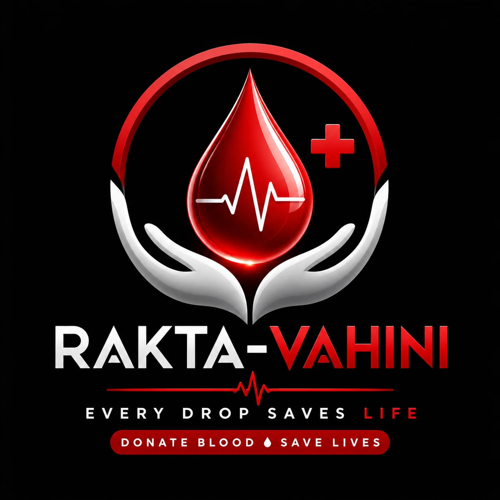

<p align="center">
  
</p>

<h1 align="center">RAKTA VAHINI</h1>

<p align="center">
  <strong>Every Drop Saves Life</strong>
</p>

<p align="center">
  
  
  
  
  
</p>

---

## 🌟 Vision

**RAKTA VAHINI** is a premium, high-impact blood donation ecosystem designed to bridge the gap between donors and patients in critical need. By leveraging modern technology and a cinematic user experience, we transform a life-saving act into a seamless, community-driven mission.

## ✨ Premium Features

-   🔴 **Critical SOS matching**: Advanced AI-powered engine to find compatible donors within seconds.
-   📍 **Cinematic Map Tracking**: Real-time visualization of donor movement and emergency coordination.
-   🛡️ **Secure Life Portal**: Enterprise-grade security for user data and medical information.
-   ⚡ **Instant Notifications**: Cloud-powered messaging for immediate emergency alerts.
-   📊 **Admin Command Center**: A powerful dashboard for managing global operations and supply chains.

## 🛠️ Technology Stack

-   **Frontend**: Jetpack Compose (Modern Declarative UI)
-   **Architecture**: MVVM + Clean Architecture
-   **Dependency Injection**: Hilt (Dagger)
-   **Backend**: Firebase (Auth, Firestore, Messaging, Crashlytics)
-   **Data Storage**: Room DB, DataStore
-   **Map Integration**: Google Maps Compose SDK
-   **Visuals**: Lottie Animations, Material 3 Design System

## 📸 Experience the App

<p align="center">
  
</p>

> [!NOTE]
> The app features a premium dark theme designed for clinical environments and night-time emergency use.

## 🚀 Getting Started

### Prerequisites
- Android Studio Ladybug+
- Google Maps API Key
- Firebase Configuration (`google-services.json`)

### Installation
1. Clone the repository
   ```bash
   git clone https://github.com/manojr8491/RAKTA-VAHINI-141.git
   ```
2. Configure `local.properties`
   ```properties
   MAPS_API_KEY=your_api_key_here
   ```
3. Sync and Run.

---

<p align="center">
  Made with ❤️ for Humanity | <b>Donate Blood • Save Lives</b>
</p>
